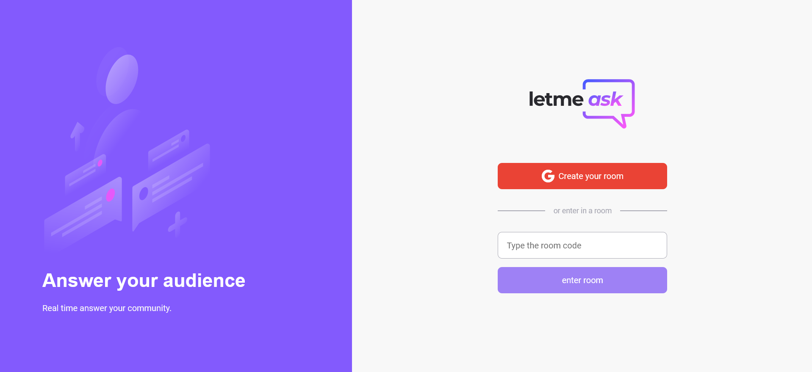

# Let me Ask - Project NLW togheter Rocketseat

## Table of contents

- [Overview](#overview)
  - [The challenge](#the-challenge)
  - [Screenshot](#screenshot)
  - [Links](#links)
- [My process](#my-process)
  - [Built with](#built-with)
  - [What I learned](#what-i-learned)
- [Author](#author)

## Overview

### The challenge

Users should be able to:

- Log in in the aplication with Google Account Login
- Create or enter in a existing room
- User admin room can see the number of likes, mark a question as highlighted, answered and remove questions
- User visitor can send new questions and like other users questions
- View the optimal layout for the site depending on their device's screen size
- See hover states for all interactive elements on the page

### Screenshot




### Links

- Solution URL: [https://github.com/gerbelli27/helloreact](https://github.com/gerbelli27/helloreact)
- Live Site URL: [https://letmeask-98d9f.web.app/](https://letmeask-98d9f.web.app/)

## My process

### Built with

- Semantic HTML5 markup
- CSS custom properties
- Flexbox
- React JS
- Firebase
- [React | Html | Css | JavaScript | Firebase]

### What I learned

With this project i was able to learn a lot about react components, hooks, database and deployment.


```JavaScript
async function handleLikeQuestions(likeId: string | undefined, questionId: string) {
    if (likeId) {
      remove(ref(db, '/rooms/' + roomId + '/questions/' + questionId + '/likes/' + likeId))
    } else {
      const newKeyLike = push(child(ref(db), 'questions/')).key;
      set(ref(db, '/rooms/' + roomId + '/questions/' + questionId + '/likes/' + newKeyLike), {
        authorId: user?.id,
      })
    }
  }
```

## Author

- Linkedin - [Eduardo Gerbelli](https://www.linkedin.com/in/eduardogerbelli/)
- Frontend Mentor - [Eduardo Gerbelli](https://www.frontendmentor.io/profile/gerbelli27)
- Github - [Eduardo Gerbelli](https://github.com/gerbelli27)